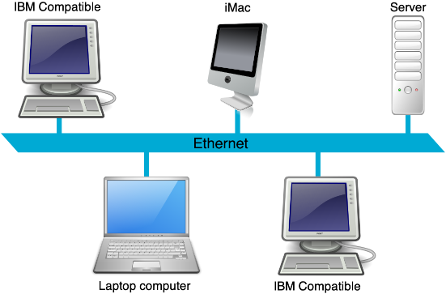
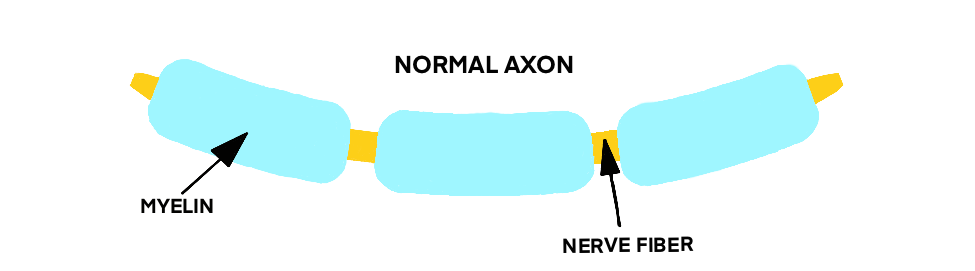

<!-- ## Base Presentation -->
# MS
### It can get on your nerves

<!-- .slide: data-transition="zoom" -->
<!-- Finish out with "MS is an invisible disease. You don't see it, but someone you know may live with it. ??? -->

---

## What is MS?

Clinically - a chronic autoimmune disease affecting the central nervous system <!-- .element: class="fragment" -->

And we're done, right?! <!-- .element: class="fragment fade-down" -->

---

## Not really
It's actually as clear as the "cog fog" <!-- .element: class="fragment fade-left" -->

Note:
When we talk about cognitive fog later this joke will make more sense - which is better than most of my jokes.

---

## What is it then?

- A disease in which the immune system attacks nerve fibers and protective myelin in the brain and spinal cord <!-- .element: class="fragment" -->
- Unpredictable<!-- .element: class="fragment" -->
- Cause unknown<!-- .element: class="fragment" -->
- Each case as unique as the individual afflicted<!-- .element: class="fragment" -->
  - with some commonalities

Note:
- In many ways, it's like an undirected hyperactive immune system that eats itself
- Being unique to each patient, it can add to a delay in diagnosis or even an initial misdiagnosis

Outro - So let's get some basics out of the way..

---

## My lan?

Uh.. no <!-- .element: class="fragment" -->

------

## What's myelin then?

It's basically a protective sheath around the nerves, including those in the brain and spinal cord.

 <!-- .element: class="fragment" -->

Note:
- Healthy nerve
- describe how electrical impulses normally move quickly at the myelin edges

- This myelin sheath allows electrical impulses to transmit quickly and efficiently along the nerve cells.
- Can kind of think of it as packetized information

Myelin is an insulating layer, or sheath that forms around nerves, including those in the brain and spinal cord. It is made up of protein and fatty substances. This myelin sheath allows electrical impulses to transmit quickly and efficiently along the nerve cells. If myelin is damaged, these impulses slow down.

------

## Demyelination

(Omaha's post-winter roads ;) )

Note:
Create lesions when destroyed and can lead to an exacerbation.
- an increase in existing or new symptoms
- the lesions is how MS gets its name (multiple scars)
When damaged, the speed at which electrical impulses can travel slows down
 - the jump points are unknown
   - it's sort of like never knowing the size of a packet
 - so have to take the longer route through the nerve itself
   - can be thought of like a synchronous, blocked transmission with multiple ACKs and checksums and resends

------

## Nerve Damage

Note:
Damage is servere and the brain needs to figure out another route altogether.
- can lead to permanent loss of function

Outro - Now that we know what is does, how does it manifest?

---

## Symptoms

Why is it called "a" symptomatic if you don't have symptoms? <!-- .element: class="fragment" -->

Because if you did have symptoms you would "b" symptomatic! 🙃 <!-- .element: class="fragment" -->

------

## Fatigue

Note:
- Fatigue - #1 symptom
 - Regardless of how much sleep one gets

------

## Numbness

Note:
- Numbness

------

## Tingling

Note:
- Tingling
 - Can feel like your skin is crawling

------

## Base Slide

Yep, something should be here...

Now, where did it go?! <!-- .element: class="fragment" -->

Note:
Some helpful notes would likely be.. helpful.
- Formatting is useful too!

---

## Base Slide

Yep, something should be here...

Now, where did it go?! <!-- .element: class="fragment" -->

Note:
Some helpful notes would likely be.. helpful.
- Formatting is useful too!

---

## Base Slide

Yep, something should be here...

Now, where did it go?! <!-- .element: class="fragment" -->

Note:
Some helpful notes would likely be.. helpful.
- Formatting is useful too!

---

## Base Slide

Yep, something should be here...

Now, where did it go?! <!-- .element: class="fragment" -->

Note:
Some helpful notes would likely be.. helpful.
- Formatting is useful too!

---

## Base Slide

Yep, something should be here...

Now, where did it go?! <!-- .element: class="fragment" -->

Note:
Some helpful notes would likely be.. helpful.
- Formatting is useful too!

---

## Base Slide

Yep, something should be here...

Now, where did it go?! <!-- .element: class="fragment" -->

Note:
Some helpful notes would likely be.. helpful.
- Formatting is useful too!

---

## Base Slide

Yep, something should be here...

Now, where did it go?! <!-- .element: class="fragment" -->

Note:
Some helpful notes would likely be.. helpful.
- Formatting is useful too!

---

## Base Slide

Yep, something should be here...

Now, where did it go?! <!-- .element: class="fragment" -->

Note:
Some helpful notes would likely be.. helpful.
- Formatting is useful too!

---

## Base Slide

Yep, something should be here...

Now, where did it go?! <!-- .element: class="fragment" -->

Note:
Some helpful notes would likely be.. helpful.
- Formatting is useful too!

---

## Base Slide

Yep, something should be here...

Now, where did it go?! <!-- .element: class="fragment" -->

Note:
Some helpful notes would likely be.. helpful.
- Formatting is useful too!

---

## Base Slide

Yep, something should be here...

Now, where did it go?! <!-- .element: class="fragment" -->

Note:
Some helpful notes would likely be.. helpful.
- Formatting is useful too!

---

## Base Slide

Yep, something should be here...

Now, where did it go?! <!-- .element: class="fragment" -->

Note:
Some helpful notes would likely be.. helpful.
- Formatting is useful too!
